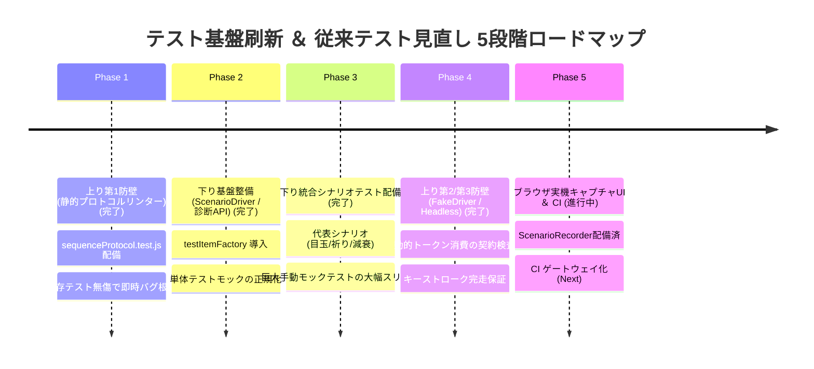

# テスト基盤刷新 ＆ 従来テスト見直し実装ロードマップ
(Testing Modernization & Test Refactoring Roadmap)

本文書は、NetHack WASM WebUI において **「下り方向（ScenarioDriver による統合イベント再生）」** と **「上り方向（3層防壁によるキーシーケンス・プロトコル検証）」** を実装し、既存の単体テスト（338件超から459件へ拡張）を段階的に移行・スリム化するための恒久的な実装ロードマップおよび運用仕様書である。

---

## 1. 全体方針とテストピラミッドの再編

従来の単体テストは個別のパースや計算を保証してきたものの、**「手作業モックの肥大化」** と **「キーストローク規約違反の偽陽性（PASSしてしまう問題）」** という課題を抱えていました。
新構想の実現に伴い、テストピラミッドを以下の4層に再編し、各レイヤーの責務を適材適所で分担します。

```
              ┌──────────────────────────────────────────────┐
              │           【Layer 4: 実機・E2E】             │
              │  ・ブラウザGUI描画、CSS/Canvas、サウンド      │
              └───────────────────────┬──────────────────────┘
                                      │
              ┌───────────────────────▼──────────────────────┐
              │ 【Layer 3: 統合・シナリオテスト (Downlink)】 │
              │  ・実機イベントログ再生 (ScenarioDriver)     │
              │  ・GKL複数マネージャー時系列連動             │
              │  ・ターン送り・減衰モデル・スナップショット  │
              └───────────────────────┬──────────────────────┘
                                      │
              ┌───────────────────────▼──────────────────────┐
              │ 【Layer 2: プロトコル規約検証 (Uplink)】     │
              │  ・静的リンター (改行・不正コマンド排除)     │
              │  ・FakeDriver 契約検査 / Headless完走検証    │
              └───────────────────────┬──────────────────────┘
                                      │
              ┌───────────────────────▼──────────────────────┐
              │    【Layer 1: 高速・純粋単体テスト (Unit)】   │
              │  ・パース計算、座標変換、辞書引き            │
              │  ・独立した1モジュールの入出力・境界値検証   │
              └──────────────────────────────────────────────┘
```

---

## 2. 従来テストの見直し方針 (Test Refactoring Policy)

| 分類 | 対象テスト | 見直し内容 |
| :--- | :--- | :--- |
| **① シナリオテストへ移行・スリム化** | `TacticalAdvisor.test.js`, `AssistSignalSynthesizer.test.js`, `WebUICore.test.js` 等の複数マネージャー手動モックテスト | 30〜50行に及ぶ手動モック構築を廃止し、`ScenarioDriver` ＋ `toMatchInlineSnapshot` によるシナリオテストへ移行。従来テスト側の重複コードを削除・スリム化。 |
| **② プロトコル検証へリプレイス** | `ITEM_INTERACTION_RULES.test.js` 等の `keySequence` 単純配列比較 | `expect(seq).toEqual(['...'])` を `SequenceProtocolValidator` による規約検査および `ProtocolValidatorFakeDriver` 完走検査へ昇格。 |
| **③ 純粋単体テストとして維持** | `TouchCalculator`, `KeyMapper`, `PromptPayloadBuilder`, `TranslationEngine`, `GameOverResolver` 等 | 外部依存のない純粋計算・パースロジックおよび各マネージャーの個別境界値テストは、全件ミリ秒実行の最前線としてそのまま維持。 |
| **④ テストファクトリによる刷新** | 単体テスト内の手書き文字列モック（`{ name: 'potion...' }`） | `testItemFactory.js`（`createTestItem`）を導入し、完全なナレッジ構造体へ統一。実装側の文字列依存コードを一掃。 |

---

## 3. 段階的実装ロードマップ (5 Phases)



---

### Phase 1: 【上り方向・第1防壁】静的プロトコルリンター導入 (完了)
依存関係がなく、実機バグ（`#pray\n` や改行混入、無効コマンド）を即座に100%遮断できる最優先フェーズ。

* **新規作成**:
  * `src/testing/SequenceProtocolValidator.js`: トークン配列の静的バリデータ。
  * `tests/protocol/sequenceProtocol.test.js`: `ITEM_INTERACTION_RULES` および `AssistSignalSynthesizer` の全ルール一括リントテスト。
* **従来テストの扱い**:
  * 既存の 338 件テストには一切手を加えず、上乗せで即座に安全ネットを確立。

---

### Phase 2: 【下り方向・基盤整備】`ScenarioDriver` とテストファクトリの実装 (完了)
シナリオテストの実行ランタイムおよび単体テストのデータ品質向上ヘルパーを整備。

* **ドライバー拡張**:
  * `src/driver/NetHackWasmDriver.js`: `startRecording()`, `stopRecording()` を実装（フラグによる通常プレイ時ゼロオーバーヘッド）。
* **ヘルパー実装**:
  * `test/helpers/ScenarioDriver.js`: `playUntilTurn()`, `stepNextTurn()`, 即答型 `queueSequence()` を備えた疑似ドライバ。
  * `test/helpers/testItemFactory.js`: `createTestItem` を実装。
* **GKL 診断 API**:
  * GKL に `core.gkl.getDiagnosticSummary()` を追加（ターン、モンスター追跡、警告、助言を1オブジェクト化）。
* **従来テストの見直し**:
  * 単体テストに残すケースの素の文字列モックを順次 `createTestItem` へ置き換え。

---

### Phase 3: 【下り方向・統合実行】シナリオテスト配備 ＆ 従来テストの移行・スリム化 (完了)
時系列・複数マネージャー連携のテストを確立し、開発者の手作業モック地獄を解消。

* **フィクスチャ配備**:
  * `test/fixtures/scenarios/` 配下に実機キャプチャ JSON 計 7 件（浮遊する目玉、コカトリス、瀕死祈り、階段移動など）を配備。
* **シナリオテスト作成**:
  * `tests/scenarios/realScenarios.test.js`: Vitest インラインスナップショット連携。
* **従来テストの見直し（大幅スリム化）**:
  * `TacticalAdvisor.test.js` や `AssistSignalSynthesizer.test.js` 内の手動モック複合テストをシナリオテストへ移行。
  * 従来テスト側は「単一関数の境界値・例外系」のみに特化させ、重複していた冗長モックコードを削除・整理。

---

### Phase 4: 【上り方向・第2/第3防壁】動的契約検査 (FakeDriver / Headless) (完了)
静的リンターでは捉えきれない動的プレースホルダー（`${writeTool}` ➔ `'b'` 等）解決後の完走を保証。

* **ヘルパー実装**:
  * `test/helpers/ProtocolValidatorFakeDriver.js`: 仮想入力ステートマシン（各 Shim 規約・プレースホルダー・改行・トークン過不足の厳密な契約検査）。
* **テスト作成**:
  * `tests/protocol/actionExecutionProtocol.test.js`: `ContextActionEngine` / `ITEM_INTERACTION_RULES` / `ASSIST_SIGNAL_DEFINITIONS` の動的解決・完走検査（16 tests pass）。
  * `tests/protocol/headlessDriverSimulation.test.js`: 本物の `NetHackWasmDriver` + モック C コアによるマルチステップ・非同期 Promise 解決・バッファ回収検証（7 tests pass）。
* **検証実績**:
  * 全 3 テストスイート 27 件のプロトコル検証テストがミリ秒単位（23ms）で 100% 通過。全体テスト（45ファイル・459テスト）の回帰検証を完了。

---

### Phase 5: 【DX向上・完全自動化】実機キャプチャ UI ＆ CI ゲートウェイ化 (進行中)
新機能追加時に誰もが数秒でシナリオテストを追加できる開発体験を確立。

* **専用 UI 実装 (完了)**:
  * `src/core/inspector/ScenarioRecorder.js`: ブラウザ画面上の極小 REC コントロールバー（[● REC] [■ Stop] [💾 Export]）およびリアルタイムメッセージデバッガー。
  * `src/core/inspector/ScenarioRecorder.test.js`: 単体テスト通過。
* **運用体制の確立 (Next)**:
  * `package.json`: `npm test` に全レイヤーのテストを組み込み済み。
  * CI（GitHub Actions）等による規約違反やデグレードの自動マージブロック環境の整備。
  * `docs/8_testing/README.md`: 新規開発者向けテスト作成ガイドをシナリオキャプチャ ＋ 静的リント基準へ全面改訂。
