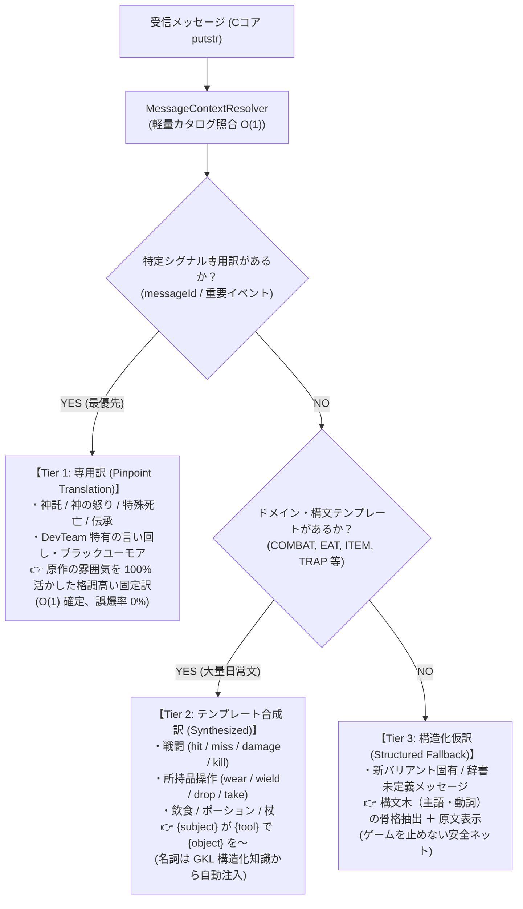

# 🌐 シグナル駆動ハイブリッド翻訳アーキテクチャ設計構想
*(Signal-Driven Hybrid Translation Architecture: Pinpoint Specialized Translations & Synthesized Templates)*

## 1. 背景と旧課題の解消経緯 (Background & Evolution)

### 1.1 旧翻訳システム（旧 2.4 構想時代）の限界
本プロジェクトの初期翻訳システム（`TranslationEngine.js` および約18,000行の `dictionary.csv`）は、画面に出力されたテキストメッセージに対して**「全文一致」および「正規表現による部分文字列置換」**を行う方式をとっていました。

しかし、このアプローチは以下の構造的限界を抱えていました：
1. **組み合わせ爆発による辞書肥大化**:
   - 「誰が（主語）」「何を（目的語）」「どうした（動詞）」の無数の組み合わせ（戦闘ログ、アイテム操作、飲食等）をベタ書き登録せざるを得ず、辞書が18,000行以上に膨張。
2. **短いフレーズ・単語の誤爆リスク**:
   - `You miss.` や `It opens.` などの短い文章が、戦闘なのか魔法なのか地形操作なのか文脈なしに一律置換され、不自然な訳文を生んでいた。
3. **未登録メッセージの文字化け・英語丸出し**:
   - 少しでも語順や名詞が辞書とズレると未翻訳（英語のまま）になるか、部分的な日本語置換によって文法が破綻したキメラ文が発生していた。

### 1.2 アーキテクチャ進展による旧課題の根本解消
かつて [legacy_translation_architecture_enhancement_plan.md](./archive/legacy_translation_architecture_enhancement_plan.md) で検討されていた「翻訳層でのかすれ文字復元」や「C本体への2バイト文字入力シム」は、すでに**プロジェクトの進化に伴い上位レイヤーで根本解決**されました：

- **床文字（かすれ文字）解析の独立・GKL移譲**:
  - GKL の `EngravingArchaeologist.js` / `LoreCodex.js` が、NetHack の仕様（840件の固定伝承ソース）に基づいて考古学的にピンポイント復元・真偽判定を達成。翻訳エンジン側で辞書全体にあいまい検索（ファジーマッチ）をかける必要は完全に消滅しました。
- **2バイト文字（呼び名・name/call）の脱・Cコア依存**:
  - C本体（WASM）の1バイトASCIIバッファに無理に日本語を通す（`[uXXXX]` シム等）必要はなく、UI層・GKL側の**「プレイヤー別名・自動呼び名フォロー（Custom Alias & Call Follower）」**としてメモリ/LocalStorageで安全に管理・表示すれば、Cコア非侵襲・文字化けリスクゼロで実現可能です。
- **Phase 5 メッセージシグナル基盤の確立**:
  - `MessageContextResolver.js` により、Cソースの `messageId`（例: `uhitm.c:hit`）、`domain`（`COMBAT`, `EAT`, `TRAP` 等）、および抽出プレースホルダ（`placeholders`）が**構造化シグナルとして確定取得**できるようになりました。

---

## 2. 思想：3層ハイブリッド翻訳モデル (Three-Tier Hybrid Model)

「すべてのメッセージを一律にテンプレート化する」のではなく、**「言い回しや重要度に応じて、特定シグナルには洗練された【専用訳】を割り当て、大量の日常文を【テンプレート訳】へ集約し、未知文を【構造化仮訳】で保護する」** という3層ハイブリッド翻訳モデルを採用します。



---

## 3. レイヤー別仕様と具体例

### 3.1 Tier 1: 特定シグナルの「専用訳」 (Pinpoint Specialized Translations)
NetHack を NetHack たらめている**「エモーショナルな言い回し」「ブラックユーモア」「文学的引用」「神々の怒り」「特殊な死に際」**に対して、`messageId` をキーとしてピンポイントで専用の訳文を割り当てます。

- **照合方式**: `SPECIALIZED_MESSAGE_MAP[context.messageId]` による $O(1)$ 決定論的マッピング。
- **特徴**: 正規表現検索を一切経由しないため、誤爆率が完全に 0%。プレースホルダが含まれる場合も自然な日本語の語順で再構成。

| 発生箇所 (`messageId`) | 原文（Cソース書式） | 従来の課題 | 新設計の「専用訳」 |
| :--- | :--- | :--- | :--- |
| `pray.c:angry` | `The voice of %s booms: "Thou hast angered me!"` | 単純置換でぎこちない | **「%s の怒号が轟いた！『汝、我を怒らせたな！』」** |
| `eat.c:L450:blecch` | `Blecch! Rotten %s!` | 名詞置換で文末破綻 | **「うげっ！ 腐った %s だ！ 吐き気がする！」** |
| `trap.c:squeak_board` | `A board beneath you squeaks %s %s.` | 音名と副詞が不自然 | **「足元の床板がきしみ、けたたましく %s の音を立てた！」** |
| `end.c:killer` | `Killed by %s.` | 直訳 | **「%s により無念の死を遂げた。」** |

### 3.2 Tier 2: グループシグナル・構文テンプレート合成訳 (Synthesized Template Translations)
辞書肥大化の主因である「戦闘ログ」「持ち物操作」「飲食」などの組み合わせ爆発メッセージを、**ドメイン別の構文テンプレート（約100〜200構文）** に集約します。

- **動的名詞注入**: テンプレート内のプレースホルダ（`{subject}`, `{object}`, `{tool}`）には、GKL の構造化知識（モンスター384体・アイテム481件）から確定した真名・外見名を自動代入。
- **文脈別テンプレート**: 同じ `hit` でも、素手・刃物・射撃・光線に応じてドメイン/サブタイプ別に最適な文型を選択。

```javascript
// 構文テンプレート定義例
export const SYNTHESIZED_TEMPLATES = {
  // 戦闘ドメイン: uhitm.c
  'uhitm:hit': '{subject} は {object} を攻撃し、命中させた！',
  'uhitm:hit_with': '{subject} は {tool} で {object} を切りつけた！',
  'uhitm:miss': '{subject} の攻撃は空を切った。',
  'uhitm:destroy': '{subject} は {object} を粉砕した！',

  // 飲食ドメイン: eat.c
  'eat:consume': '{subject} は {item} を平らげた。',
  'eat:full': 'もう一口も入らない……腹がはち切れそうだ！',

  // 所持品ドメイン: invent.c
  'invent:wield': '{item} を構えた。',
  'invent:wear': '{item} を身につけた。'
};
```

### 3.3 Tier 3: 未定義・未知メッセージの「構造化仮訳」 (Structured Fallback)
辞書に専用訳もテンプレートも登録されていない未知のメッセージ（稀なイベント、別バリアントの独自メッセージ等）を受信した場合の安全ネットです。

- **構造抽出**: Cソースの書式パターン（`%s ... %s`）から主語・動詞・目的語の骨格を特定。
- **提示形式**:
  - `[モンスター名] が何かをした。(未翻訳: "The mysterious creature wiggles its tentacles.")`
  - ゲームの進行を一切阻害せず、プレイヤーが文脈を即座に把握できるようにアシスト。

---

## 4. プレイヤー別名・自動呼び名フォロー (Custom Alias & Call Follower)

NetHack では未識別アイテムやモンスターに名前を付ける（`#name` / `#call` コマンド）プレイが頻繁に行われます。

### 4.1 設計方針
- **Cコア非侵襲**: WASM ドライバへの送信は英数字（ASCII）のまま維持し、C 本体のバッファ長制限や 1 バイト削りによる文字化けを完全排除。
- **GKL / UI 層でのエイリアス管理**:
  - プレイヤーが日本語で「毒消し？」「テレパシー」「即死注意」などと名付けた場合、GKL の `CustomNameStore`（LocalStorage 永続化）に `{ glyphOrItemType, alias: "毒消し？" }` として保持。
  - レンダラーおよびインベントリUI描画時に、GKL が自動で日本語別名をバッジや注釈としてオーバーレイ表示。

---

## 5. 辞書スリム化の試算とロードマップ (Dictionary Streamlining Impact)

| 項目 | 従来の辞書 (`dictionary.csv`) | 新・シグナル駆動ハイブリッド辞書 | 削減・改善効果 |
| :--- | :--- | :--- | :--- |
| **データ容量・行数** | **約 18,000 行 (約 1.2 MB)** | **合計 約 1,000〜1,500 行 (< 100 KB)** | **行数・容量ともに 90% 以上削減** |
| **戦闘・日常文** | 数千行のベタ書き組み合わせ | **約 150 件の構文テンプレート** | 単純パターンの完全排除 |
| **名詞（モンスター・アイテム）** | 辞書内に重複して大量保持 | **GKL 既存データ（384体・481品）から動的解決** | DRY原則の徹底（二重持ち廃止） |
| **文学的・特殊メッセージ** | 一般行に埋もれて誤爆の温床 | **特定シグナル専用訳（約500〜800件）** | 誤爆率 0%、翻訳品質の飛躍的向上 |
| **保守性・多バリアント追従** | 新バリアントごとに何千行も追記 | **テンプレートと名詞の差し替えのみ** | JNetHack, Slash'EM への即応 |

---

## 6. 段階的マイグレーション計画 (Implementation Steps)

1. **Phase 1: 構文テンプレートエンジン基盤の実装**
   - `TemplateTranslationSynthesizer.js` の新設。
   - `MessageContext` のプレースホルダと GKL 名詞マスタ（モンスター・アイテム）の結合テスト。
2. **Phase 2: 特定シグナル専用訳カタログ (`SpecializedTranslationCatalog.js`) の構築**
   - 神託、神の怒り、特殊死亡、DevTeam 特有メッセージなどの専用訳テーブルを定義。
   - `MessageContextResolver` からの $O(1)$ 優先ディスパッチ配線。
3. **Phase 3: 既存 `dictionary.csv` の統廃合とスリム化**
   - テンプレート化された戦闘・持ち物ログを既存辞書から一括パージ。
   - 辞書サイズを 18,000 行からコンパクトな辞書へ圧縮。
4. **Phase 4: プレイヤー別名・自動呼び名フォロー (`CustomNameStore`) の配備**
   - UI/GKL 層での安全な日本語エイリアス管理の実装。
