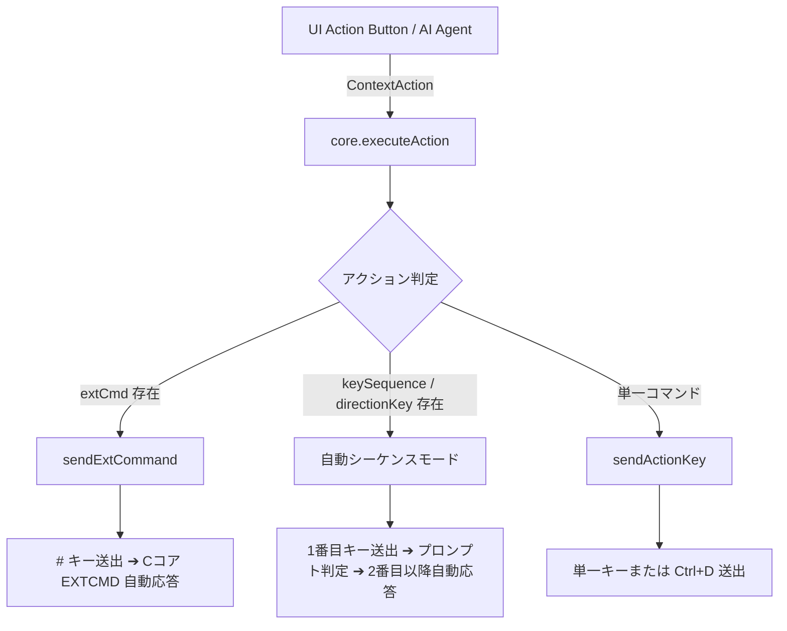

# ContextAction & executeAction API 仕様書

`WebUICore` が提供する文脈依存推奨アクション (`ContextAction`) のデータ構造と、それを自動実行する `core.executeAction(action)` のコマンドフォーマット定義ドキュメントです。

---

## 1. 概要

`WebUICore.prototype.executeAction(action, delayMs)` は、`ContextActionEngine` またはフロントエンド UI から渡された `ContextAction` オブジェクトを安全に解釈し、NetHack C コアへのキー送信・拡張コマンド発行・方向プロンプト自動応答までをモーダル割り込みなしで連続実行するメイン API です。



---

## 2. ContextAction データ構造 (Schema)

`ContextAction` オブジェクトは以下のプロパティで構成されます。

```typescript
interface ContextAction {
    /** ユニークなアクション識別子 (例: 'ACTION_OPEN_DOOR_n', 'ACTION_SIT_FLOOR') */
    id: string;

    /** カテゴリ (INTERACT, COMBAT, ITEM, MOVEMENT 等) */
    category: 'INTERACT' | 'COMBAT' | 'ITEM' | 'MOVEMENT';

    /** 英語表示ラベル (例: 'Open door', 'Sit on floor') */
    label: string;

    /** 日本語表示ラベル (例: '扉を開ける (Open)', '床に座る (Sit)') */
    labelJa?: string;

    /** 元コマンド表現 (例: 'o', 'C-d', '#sit', 'a') */
    key: string;

    /** メイン文字表現 (例: 'o', 'C-d', '#sit') */
    charStr?: string;

    /** 拡張コマンド名 (# を除いた純粋な名称, 例: 'sit', 'chat', 'loot', 'untrap', 'pay', 'pray') */
    extCmd?: string;

    /** 連続キー送出シーケンス (例: ['o', 'j'], ['a', 'b', 'l'], ['C-d', 'k']) */
    keySequence?: string[];

    /** アクション対象の方向キー (デフォルト Vi-keys: 'j', 'k', 'h', 'l', 'y', 'u', 'b', 'n') */
    directionKey?: string;

    /** 方向情報オブジェクト ({ code: 'N'|'NE'|'E'|'SE'|'S'|'SW'|'W'|'NW', name: '北', key: 'k', dx: 0, dy: -1 }) */
    direction?: {
        code: 'N' | 'NE' | 'E' | 'SE' | 'S' | 'SW' | 'W' | 'NW' | 'SELF';
        name: string;
        key: string;
        dx: number;
        dy: number;
    };

    /** リスクレベル (null: 安全, 'warning': 警告, 'danger': 危険・要確証モーダル) */
    risk?: null | 'warning' | 'danger';

    /** UI表示の優先度 (数値が大きいほど上に配置) */
    priority: number;

    /** アクションの対象 ('self', 'feet', 'adjacent', 'inventory') */
    target?: 'self' | 'feet' | 'adjacent' | 'inventory';

    /** 英語説明文 */
    description?: string;

    /** 日本語説明文 */
    descriptionJa?: string;
}
```

---

## 3. コマンドパターンとフォーマット仕様

`executeAction` は `action` オブジェクトのプロパティ構成によって自動的に最適な処理モードを選択します。

### パターン 1: 単一コマンド (Single Key Command)
方向キーや中間入力が不要な単一アクション。

* **使用例**: 探索 (`s`), 上り階段 (`<`), 道具確認 (`i`)
* **フォーマット**:
  ```json
  {
    "id": "ACTION_SEARCH",
    "key": "s",
    "charStr": "s",
    "labelJa": "隠し扉・罠を探す (Search)"
  }
  ```

### パターン 2: 制御キー付きコマンド (Control Key Command)
`Ctrl+D` (蹴る: Kick) などの制御キーを要するアクション。

* **表記ルールの規定**: `key` や `charStr` に `"C-d"` または `"Ctrl-d"` を指定。
* **動作メカニズム**: `sendActionKey("C-d")` 内で自動的に **ASCII 4 (Ctrl+D / Kick)** に変換されて C コアへ送信されます。単なる `"C"` (Name コマンド) に誤変換されることはありません。
* **フォーマット**:
  ```json
  {
    "id": "ACTION_KICK_DOOR_s",
    "key": "C-dj",
    "keySequence": ["C-d", "j"],
    "charStr": "C-d",
    "directionKey": "j",
    "labelJa": "扉を蹴破る (Kick)"
  }
  ```

### パターン 3: 方向指定付きシーケンスコマンド (Directional Sequence Command)
コマンド文字と方向キー（および道具選択キー）を連続で自動送出するアクション。

* **使用例**: 扉を開ける (`o` + 方向 `j`), 鍵で解錠 (`a` + 鍵レター `b` + 方向 `l`)
* **動作メカニズム**:
  1. `keySequence` または `[charStr, directionKey]` からキーキューを生成。
  2. 1番目のキーを送信後、`isExecutingSequence = true` に設定して画面モーダル表示をスキップ。
  3. C コアからのプロンプト（`"In what direction?"` 等）に対し、`sequenceQueue` から2番目以降のキーを自動応答返送。
* **フォーマット**:
  ```json
  {
    "id": "ACTION_UNLOCK_DOOR_e",
    "key": "abl",
    "keySequence": ["a", "b", "l"],
    "charStr": "a",
    "directionKey": "l",
    "labelJa": "扉を解錠 (b)"
  }
  ```

### パターン 4: 拡張コマンド (Extended Command)
`#` で始まる NetHack の拡張コマンドアクション。

* **注意規定**: **必ず `extCmd: 'sit'` のように `#` を除いた純粋なコマンド名を指定**してください。`extCmd` が空の場合、単なる文字送信へ流れて `"Unrecognized extended command"` エラーになります。
* **使用例**: 床に座る (`#sit`), 祭壇に捧げる (`#offer`), 泉に浸す (`#dip`)
* **フォーマット**:
  ```json
  {
    "id": "ACTION_SIT_FLOOR",
    "key": "#sit",
    "charStr": "#sit",
    "extCmd": "sit",
    "labelJa": "床に座る (Sit)"
  }
  ```

### パターン 5: 拡張コマンド + 方向指定シーケンス
方向指定を要する拡張コマンド。

* **使用例**: 対象に話しかける (`#chat` + 方向 `k`), 店主に支払う (`#pay` + 方向 `l`)
* **動作メカニズム**:
  1. `#` キーを送信。
  2. C コアからの `EXTCMD` プロンプトに対し、`extCmd` 名 ('chat') を自動応答。
  3. C コアからの `DIRECTION` プロンプトに対し、`directionKey` ('k') を自動応答。
* **フォーマット**:
  ```json
  {
    "id": "ACTION_CHAT_NPC_n",
    "key": "#chatk",
    "charStr": "#chat",
    "extCmd": "chat",
    "directionKey": "k",
    "labelJa": "対象に話しかける (#chat)"
  }
  ```

---

## 4. UI クライアント側での呼び出し実装標準

PoC クライアントや将来の Web/モバイル UI では、ボタンの `onclick` イベント等で以下の呼び出し標準を適用してください。

```javascript
// UI ボタンのイベントハンドラー共通処理
window.executeContextAction = function(action) {
    if (!action) return;

    // 危険アクションへの確認ダイアログ
    if (action.risk === 'danger') {
        const ok = confirm(`【⚠️ 危険な行動】\n"${action.labelJa || action.label}" を実行しますか？`);
        if (!ok) return;
    }

    // core.executeAction への一括委任 (推奨呼び出しパターン)
    if (typeof core.executeAction === 'function') {
        core.executeAction(action);
    } else {
        // フォールバック処理
        const mainCmd = action.charStr || action.key;
        core.sendKey(mainCmd);
    }
};
```

---

## 5. まとめ・チェックリスト

開発者が新たな推奨アクションを `ContextActionEngine` に追加する際は、以下のチェックリストを確認してください。

- [ ] `#` で始まるアクションには `extCmd: 'コマンド名'` (例: `extCmd: 'untrap'`) が付与されているか？
- [ ] `Ctrl+D` などの制御キーには `key: 'C-d'`, `charStr: 'C-d'` を使用しているか？
- [ ] 複数ステップ操作には `keySequence: ['a', 'b', 'l']` を明記しているか？
- [ ] 隣接対象への操作には `directionKey: 'j'` が指定されているか？

---

## 6. 方向指定とキーモード変換 (Vi-keys vs NumPad vs Direction Code)

`ContextAction` では、**直接のキー文字列 (`directionKey: 'j'`) とセマンティックな方向コード (`direction.code: 'S'`) の両方を提供** しています。

### 方角コードのマッピング一覧

| 方向コード (`direction.code`) | 日本語名 (`direction.name`) | デフォルト Vi-keys (`directionKey`) | テンキー (NumPad) |
| :--- | :--- | :--- | :--- |
| **`N`** | 北 | `k` | `8` |
| **`NE`** | 北東 | `u` | `9` |
| **`E`** | 東 | `l` | `6` |
| **`SE`** | 南東 | `n` | `3` |
| **`S`** | 南 | `j` | `2` |
| **`SW`** | 南西 | `b` | `1` |
| **`W`** | 西 | `h` | `4` |
| **`NW`** | 北西 | `y` | `7` |
| **`SELF`** | 足元 | `.` | `5` |

### クライアント UI での活用パターン

* **標準自動実行 (`executeAction`)**: デフォルトの Vi-keys 表現 (`directionKey: 'j'`) で C コアに即座に送信されます。
* **キーモードカスタマイズ (テンキー設定等)**: UI クライアント側で NetHack の `number_pad` オプションが有効になっている場合、`action.direction.code` (`'S'`) をキーマップ関数に通すことで、自動的に `2` (テンキー) や矢印キーに変換して送信することが可能です。
