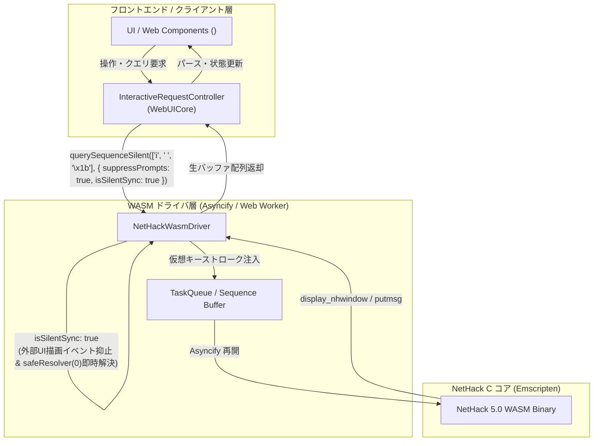
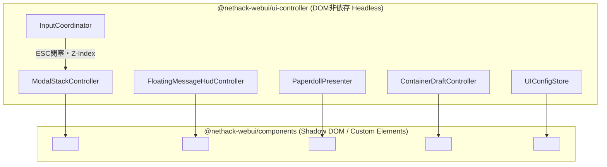
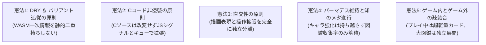

# 🧭 NetHack WASM WebUI システム現有能力カタログ (SYSTEM_CAPABILITIES.md)
### ―― システム全機能・API・データ資産インベントリ ＆ 責務境界・統廃合・ギャップ分析 ――

> [!IMPORTANT]
> **設計・機能提案・リファクタリング時の最重要必読インベントリ**  
> 本ドキュメントは、NetHack WASM WebUI プロジェクトにおける **「現在システムができること・持っている能力・API・データ資産」** を網羅的に集約した公式カタログです。  
> 新機能の提案やリファクタリングを検討する際は、必ず本カタログを参照し、**「既存機能の考慮漏れ」「車輪の再発明（静的二重持ち等）」** を防止してください。

---

## 📑 目次

1. [① コア通信・同期パイプライン (Communication & Sync Capabilities)](#①-コア通信同期パイプライン-communication--sync-capabilities)
2. [② ゲーム状態追跡・解析エンジン (State & Analysis Engines)](#②-ゲーム状態追跡解析エンジン-state--analysis-engines)
3. [③ データ・伝承資産 (Data & Lore Assets)](#③-データ伝承資産-data--lore-assets)
4. [④ UI制御・操作調停 (UIController & Web Components)](#④-ui制御操作調停-uicontroller--web-components)
5. [⑤ アーキテクチャの基本憲法（設計判断ルール）](#⑤-アーキテクチャの基本憲法設計判断ルール)
6. [⑥ 機能重複の統廃合候補 (Consolidation Candidates)](#⑥-機能重複の統廃合候補-consolidation-candidates)
7. [⑦ 不足機能・未接続パイプラインのギャップ分析 (Capability Gaps & Missing Links)](#⑦-不足機能未接続パイプラインのギャップ分析-capability-gaps--missing-links)

---

## ① コア通信・同期パイプライン (Communication & Sync Capabilities)

ブラウザ環境で NetHack C コア (WASM) を安全・高速・非同期に駆動し、画面描画を乱さずに内部データを抽出・同期する中核インフラストラクチャです。



### 1.1 サイレント・キーシーケンス実行 (`querySequenceSilent` / `queueSequence`)

* **主要クラス / 関数**:
  - `InteractiveRequestController.querySequenceSilent(sequenceOrRecipe, options)`
  - `NetHackWasmDriver.queueSequence(tokens, options)`
  - `WebUICore.querySequenceSilent(sequenceOrRecipe, options)`
  - `GKLPlugin.syncInventorySilent()` / `syncSpellsSilent()` / `syncAttributesSilent()` / `syncSkillsSilent()` / `syncDiscoveriesSilent()`
* **できること**:
  - `suppressPrompts: true, isSilentSync: true` オプションにより、**画面のちらつきゼロ（UI描画イベントの外部発火なし）** で、C コアに仮想キーストローク列を自走注入し、生成されたテキスト出力バッファを Promise で一括キャプチャ。
  - 実行中に発生したブロッキングウィンドウ（`display_nhwindow`、ヘルプ画面、メニュー等）やファイル表示（`display_file`）を検知し、残存トークンの消費または `safeResolver(0)` による**即座クローズを全自動実行してデッドロックを構造的に根絶**。
* **主要活用実績・ユースケース**:
  1. **所持品同期 (`syncInventorySilent`)**: `['i', ' ', '\x1b']` を投入し、全所持品の文字列表記・レター・個数を即時抽出。
  2. **魔法同期 (`syncSpellsSilent`)**: `['+', ' ', '\x1b']` を投入し、習得魔法名・レベル・詠唱失敗率・ターン残数を獲得。
  3. **属性・耐性同期 (`syncAttributesSilent`)**: `['\x18', ' ', '\x1b']` (`^X`) を投入し、内因性耐性や属性値を獲得。
  4. **スキル熟練度同期 (`syncSkillsSilent`)**: `['#', 'enhance', ' ', '\x1b']` を投入し、スキルツリーと向上可能状態を獲得。
  5. **発見済みアイテム同期 (`syncDiscoveriesSilent`)**: `['\\', ' ']` を投入し、既知の外見・真名マッピングを獲得。
  6. **コンテナ自動トランザクション (`ContainerController.executeTransaction`)**: バックグラウンドで出し入れシーケンスを安全に一括実行。

### 1.2 メッセージ抑止制御 (`suppressMessage` / `suppressedEvents`)

* **主要クラス / 関数**:
  - `NetHackWasmDriver.prototype.emit(event, payload)`（抑止フィルター）
  - `WebUICore.js` / `NetHackWasmDriver.js`
* **できること**:
  - `isSilentSync: true` またはモーダル操作中の一時的メッセージブロック機構。
  - C コアから送出される `putmsg`, `putstr`, `raw_print`, `raw_print_bold`, `putmixed`, `inputRequired`, `display_nhwindow`, `clear_nhwindow` などのイベント通知を一時的にインターセプト・破棄。
* **活用ユースケース**:
  - モーダル（アイテム選択、コンテナ出し入れ、ペーパードール自動換装等）実行中に、C コアが出力する「What do you want to take off?」や「You cannot wear...」といった中間プロンプトが画面上のフローティングHUDやログドロワーに漏れるのを完全に遮断。

### 1.3 2段構えシグナル基盤 (Two-Tier Signal Architecture)

客観的なゲーム事実の抽出と、それに基づく主観的戦術判断を疎結合に分離する2段パイプラインです。

```mermaid
flowchart LR
    subgraph Tier1 ["第1層: WebUICore (客観事実の同定)"]
        Msg[生メッセージ / LORE] --> MCD[MessageContextResolver]
        MCD --> SD[SignalDetector]
        SD -->|situationSignal\n{ type, context }| CoreEmit[core.emit('situationSignal')]
    end

    subgraph Tier2 ["第2層: GKL (主観的判断・キャッシュ化)"]
        CoreEmit --> GKL[GKLPlugin / InteractionContext]
        GKL --> SC[SituationCache]
        SC --> TA[TacticalAdvisor]
        SC --> AS[AssistSignalSynthesizer]
        TA -->|戦術バッジ / 警告| View[クライアントUI / HUD]
        AS -->|アシストスタンス / ContextActions| View
    end
```

* **主要クラス / 関数**:
  - **第1層 (WebUICore)**: `MessageContextResolver`, `SignalDetector`, `ContextFrameBuffer`, `core.emit('situationSignal')`
  - **第2層 (GKL)**: `GKLPlugin`, `InteractionContext`, `SituationCache`, `TacticalAdvisor`, `AssistSignalSynthesizer`
* **できること**:
  - **第1層**: C コアのメッセージ文字列やプロンプトから、「戦闘発生」「空腹警告」「呪詛検知」「床彫り発見」「伝承検知」などの客観的事実を正規化シグナルとして同定。
  - **第2層**: 第1層のシグナルをトリガーに `SituationCache` を自動更新。プレイヤーの現在のステータス・装備・周辺マップ・所持品と複合照合し、推奨アクション（ContextActions）や危険警告（Tactical Advice）を即座に導出。
* **活用ユースケース**:
  - 毒攻撃を受けた瞬間に、第1層が `POISON_ATTACK` を同定 ➔ 第2層がインベントリの「ユニコーンの角」を検知し、画面上にワンタップ解毒ボタンを自動出現させる。

---

## ② ゲーム状態追跡・解析エンジン (State & Analysis Engines)

WASM 単体では得られない高次のゲーム状態をリアルタイムに追跡・推論・整形する頭脳部です。

### 2.1 識別の5段階管理 (`ItemIdentificationResolver`)

* **主要クラス / 関数**:
  - `src/core/knowledge/engines/ItemIdentificationResolver.js`
  - `IDENTIFICATION_LEVELS`: `UNIDENTIFIED` (Lv.0), `BUC_KNOWN` (Lv.1), `NAMED` (Lv.2), `TYPE_IDENTIFIED` (Lv.3), `FULLY_IDENTIFIED` (Lv.4)
  - `resolveIdentificationState(itemOrStr, discoveryState)`
  - `APPEARANCE_PATTERNS`, `IDENTIFICATION_TIPS`
* **できること**:
  - インベントリ行や Look メッセージ文字列から、現在の識別深度を5段階で高精度に同定。
  - ランダム化された外見名（薬の色 26種、指輪の素材 26種、魔法書の装丁 31種、杖の素材 27種、アミュレットの形状 11種、防具の一般名 32種、灰色の石等）を完全照合。
  - **ネタバレ防止マスク**: 未識別アイテムに対しては真の効能を隠蔽し、安全な外見スペックおよびカテゴリ別の鑑定ヒント（床彫り、流し台、価格鑑定等）を自動提示。
* **活用ユースケース**:
  - 初心者が未識別の杖や薬を拾った際、安全に試せる床彫り・流し台テスト手順を詳細モーダルにガイド表示。

### 2.2 適応型スペック生成 (`ItemSpecPresenter` / `MonsterSpecPresenter`)

* **主要クラス / 関数**:
  - `src/core/knowledge/presenters/ItemSpecPresenter.js` (`getAdaptiveItemSpecs`)
  - `src/core/knowledge/presenters/MonsterSpecPresenter.js` (`getAdaptiveMonsterSpecs`)
  - `src/core/knowledge/presenters/EncumbrancePresenter.js`
* **できること**:
  - カテゴリ（武器、防具、指輪、巻物等）ごとに最適なスペックバッジ（重量、材質、AC、攻撃力ダイス、効果）を抽出。
  - `SkillStateManager` と動的に突合し、**プレイヤーのスキル熟練度に応じた適性バッジ（得意武器マーク、向上可能マーク `+`）をリアルタイム付与**。
  - モンスターの危険度レベル、移動速度、耐性一覧、特殊攻撃リスク、死体摂食効果（耐性獲得率等）を適応型バッジとして生成。無効値（0, null, undefined）は自動除外。
* **活用ユースケース**:
  - ペーパードールやインベントリでの装備選定時に、自分の職業・スキルに合致しているか、現在の鎧よりACが優れているかをひと目で判別可能。

### 2.3 遠隔・足元オンデマンド調査 (`OnDemandLookService`)

* **主要クラス / 関数**:
  - `src/core/knowledge/services/OnDemandLookService.js` (`executeLook`, `buildLookSequence`, `parseLookResponse`)
  - `src/core/knowledge/lore/ElberethAnalyzer.js` (`analyze`, `WARD_STATUS`, `DEGRADED_CHAR_MAP`)
  - `src/core/knowledge/lore/EngravingArchaeologist.js`
* **できること**:
  - マップ座標（x, y）指定により、バックグラウンドで Far look（`;` コマンド＋抽象方向トークン）をサイレント実行。
  - 個体の動的状態（ペット、友好、敵対、自分自身）をリアルタイム判定。
  - **床文字・Elbereth 劣化判定**: 床に刻まれた文字列から残存率（0.0〜1.0）と文字消え（wipeout_text による文字崩れ `DEGRADED_CHAR_MAP`）を解析し、聖なる結界としての有効性（`ACTIVE`, `DEGRADED`, `NONE`）を判定。
* **活用ユースケース**:
  - マップ上の敵にカーソルを合わせた瞬間に敵対/友好を判定して攻撃誤爆を防止。足元の Elbereth 結界が文字消えした際に即座に警告音・再刻み案内を出す。

### 2.4 装備依存解析 (`EquipmentActionPlanner` / `EquipmentRules`)

* **主要クラス / 関数**:
  - `src/core/knowledge/equipment/EquipmentActionPlanner.js` (`plan`)
  - `src/core/knowledge/equipment/EquipmentDependencyAnalyzer.js` (`analyzeDependency`)
  - `src/core/knowledge/equipment/EquipmentRules.js` (`EQUIP_SLOTS`, `estimateActionTurns`)
* **できること**:
  - NetHack 5.0 C コア（`do_wear.c`）の厳密な防具・装身具着脱ルールに基づき、多段換装シミュレーションを実行。
  - 例：Tシャツを着替える際、上に着ている「鎧」と「マント」を順に脱ぎ、Tシャツを着替えた後に元に戻す**キーストローク列（`ActionRecipe`）と総所要ターン数を自動算出**。
  - 呪詛（Cursed）による脱衣ブロッカー検知、手袋なしでのコカトリス死体接触などの致命的事故を事前遮断。
* **活用ユースケース**:
  - ペーパードールUI上でのワンクリック完全換装。事故死リスクのある誤操作を未然に防止。

---

## ③ データ・伝承資産 (Data & Lore Assets)

NetHack 50年の歴史と公式リソースを完全網羅した構造化データ資産です。

| アセット分類 | 主要ファイル / 配置 | レコード数 / 規模 | 特徴と活用機能 |
| :--- | :--- | :--- | :--- |
| **Cコア公式文学引用** | `dat/data.base`<br>`dat/data_jp.base` | 4,000+ 引用項目 | WASM 内にコンパイル同梱。シェイクスピア、クトゥルフ神話、指輪物語などの公式文学引用を動的クエリ可能。 |
| **伝承マスター** | `src/core/knowledge/lore/data/LoreMasterData.js` | 噂 787件<br>神託 20件<br>墓碑銘 48件 | 真偽判定（`isTrue`）完備。噂 366件・神託 19件がアイテム番号（`onum`）と完全事前紐付け済み。 |
| **構造化モンスター辞書** | `src/core/knowledge/data/MONSTER_KNOWLEDGE_FULL.js` | 全 384 体 | 日英完全対訳、耐性、攻撃ダイス、速度、死体効果、危険度ランク。静的整合性監査済み。 |
| **構造化アイテム辞書** | `src/core/knowledge/data/OBJECT_KNOWLEDGE_FULL.js` | 全 481 アイテム<br>(onum 0〜480) | 日英完全対訳、防護耐性（`protectsAgainst`）、材質、基本価格、重量、効果。静的整合性監査済み。 |
| **ビジュアルタイルシート** | `pict/nethack_default_32.png`<br>`pict/nethack_default_32_tr.png` | 32×32px タイル | 公式グラフィックスタイル。全グリフ対応。`GlyphHelper.js` による CSS スプライト座標切り出し。 |
| **制御シグナル辞書** | `src/core/prompt/ControlSignalCatalog.js` | 全 115 制御パターン | プロンプト・待機状態の同定と自動応答キー定義。 |

---

## ④ UI制御・操作調停 (UIController & Web Components)

DOM 非依存の Headless UI 層と、モダンなダークガラス Web Components による最高峰のフロントエンド基盤です。



### 4.1 キー入力調停 (`InputCoordinator` / `ModalStackController`)

* **主要クラス / 関数**:
  - `src/ui-controller/InputCoordinator.js` (`evaluateKeyDown`, `ROUTE_ACTIONS`)
  - `src/ui-controller/ModalStackController.js` (`push`, `pop`, `getTopModal`, `hasModals`)
* **できること**:
  - 多重モーダル表示時のスタック管理と Z-Index 自動解決。
  - `ESC` キー押下時に「最前面のモーダル1枚だけを閉じる」安全な閉塞制御。
  - テキスト入力中（`INPUT` / `TEXTAREA`）の NetHack ゲームキー誤爆防止。
  - **Vanilla / Enhanced の操作直交性**: 純粋なゲーム操作キー（`PASSTHROUGH_GAME_KEY`）と UI ショートカット（Alt+S, Ctrl+P 等）を厳密に調停。

### 4.2 共通 Web Components (`<nh-*>`)

* **主要コンポーネント (`src/components/`)**:
  - `<nh-modal>`: FocusTrap、ESC 閉塞、多重スタック対応の共通モーダル枠。
  - `<nh-floating-hud>`: 全画面ダンジョンマップ上に透過オーバーレイする最新メッセージ行。太字強調・世代別フェードアウト完備。
  - `<nh-paperdoll>`: 人形型装備スロット（頭、鎧、マント、武器、盾、指輪、靴等）。ドラッグ＆ドロップおよび換装差分プレビュー対応。
  - `<nh-container-filer>`: 2画面コンテナ出し入れファイラー。数量スライダー、BoH 防爆安全ガード（Bag of Holding 爆発防止）完備。
  - `<nh-ui-config>`: Neo-Retro Dark Glass UI 設定パネル。プリセット管理・LocalStorage 永続化。

---

## ⑤ アーキテクチャの基本憲法（設計判断ルール）

すべての新機能開発・リファクタリングにおいて遵守すべき **「5大原則」** です。



### 憲法 1: DRY ＆ バリアント追従の原則 (Single Source of Truth)
WASM（C コア）が内部で保持している一次情報（所持品、習得魔法、属性値、耐性、発見済みアイテム、公式文学引用）は、JavaScript 側で静的に二重持ちしてはならない。  
必ず `querySequenceSilent`（`suppressPrompts: true`）を用いて C コアから動的に引き出し、初回取得後はメモリキャッシュ（0ms レスポンス）で運用する。これにより、将来的な NetHack のバリアント（Slash'EM、UnNetHack 等）やバージョン改定に完全自動追従する。

### 憲法 2: C コード非侵襲の原則 (Non-Invasive C-Core)
NetHack 本体の C ソースコードを独自に改変してはならない。  
機能拡張はすべて、Emscripten / Asyncify、Web Worker メッセージング、仮想キーシーケンス、JavaScript 層のシグナル同定基盤を用いて非侵襲に実現する。公式 NetHack のコードベースをクリーンに保つことで、本家アップデートの即時マージを可能にする。

### 憲法 3: 直交性の原則 (Orthogonality of Render & Input)
「描画表現（ASCII ⇄ 2Dタイル ⇄ WebGPU HD-2D）」と「操作性（Vanilla 操作 ⇄ Enhanced 拡張操作）」は完全に直交し、独立して切り替え可能でなければならない。  
「タイル描画でクラシックなキーボード操作のみを行う」「ASCII 描画でマウス・ペーパードール操作を行う」など、プレイヤーがあらゆる組み合わせを自由に選択できる自由度を保証する。

### 憲法 4: パーマデス維持と知のメタ進行 (Permadeath & Meta-Knowledge)
NetHack 本来の醍醐味である「パーマデス（死んだらキャラクター能力・所持品は一切持ち越せない）」を厳格に堅持する。  
セッション横断で持ち越す要素は、プレイヤー自身の知識の結晶である「伝承図鑑収集率（%）」「アイテム発見履歴」「死因・墓碑銘アーカイブ」などの **「知の蓄積（メタ進行）」** に限定する。

### 憲法 5: ゲーム内（即時）とゲーム外（鑑賞）の疎結合 (In-Game vs Out-Game Decoupling)
ゲームプレイ中の操作性を阻害してはならない。プレイ中に表示するナレッジは、ミリ秒単位で開き最小限の視線移動で把握できる超軽量な単体カード（`<nh-knowledge-card>`）とする。  
全モンスター・全アイテム・全伝承を一覧・鑑賞する大図鑑は、タイトル画面やゲーム外の独立ツール（`compendium.html`）として分離展開する。

---

## ⑥ 機能重複の統廃合候補 (Consolidation Candidates)

コードベースの肥大化と保守コストを削減するため、今後計画的に統合・整理すべき重複機能の棚卸しリストです。

| 対象機能 / UI | 現状の重複状況 | 一本化・統廃合先 | 統合によるメリット |
| :--- | :--- | :--- | :--- |
| **ナレッジ詳細モーダル** | `KnowledgeDetailModal.js` (Nehww独自)<br>`TextWindowModal.vue` (Vueサンプル)<br>各種インスペクター | **`<nh-knowledge-card>`**<br>(Web Components 新設) | 全クライアントで同一のリッチスペック・戦術・伝承カードを利用可能になり、CSS/DOM 重複を完全根絶。 |
| **メッセージHUD / ログ** | `FloatingMessageHud.js` (Nehww独自)<br>`MessageHistoryDrawer.js`<br>`<nh-floating-hud>` | **`FloatingMessageHudController`** ＋ **`<nh-floating-hud>`** | Headless コントローラーと標準 Web Components への一本化により、描画ロジックの二重実装を解消。 |
| **コンテナ出し入れ操作** | `ContainerModal.js` (Nehww独自)<br>`<nh-container-filer>` (共通基盤) | **`<nh-container-filer>`** | 二画面コンテナ操作、数量ドラフト、BoH 防爆安全ガードのロジックを共通コンポーネント1つに集約。 |
| **ペーパードール装備** | `PaperdollModal.js` (Nehww独自)<br>`<nh-paperdoll>` (共通基盤) | **`<nh-paperdoll>`** | 部位判定・ドラッグ＆ドロップ・換装シミュレーションのロジックを一元化。 |
| **モーダルスタック管理** | `ModalManager.js` (Nehww独自)<br>`ModalStackController.js` (Headless) | **`ModalStackController`** | ESC 閉塞・FocusTrap・Z-Index 解決を Headless パッケージに完全統一。 |

---

## ⑦ 不足機能・未接続パイプラインのギャップ分析 (Capability Gaps & Missing Links)

「データや解析エンジンはすでに実装・完成しているが、UI や操作パイプラインと未接続な機能」の洗い出しです。今後の開発における最優先実装候補となります。

```mermaid
flowchart TD
    subgraph Gap1 ["ギャップ 1: ディスカバリー図鑑 UI の未接続"]
        D1["Cコア '\\' コマンド"] -->|サイレント同期済| D2["DiscoveryStateManager"]
        D2 -.->|❌ 未接続| D3["ゲーム内 発見済みアイテム図鑑UI"]
    end

    subgraph Gap2 ["ギャップ 2: 価格識別からの自動命名パイプライン"]
        P1["店舗売買メッセージ"] -->|シグナル同定済| P2["OBJECT_KNOWLEDGE_FULL (basePrice)"]
        P2 -.->|❌ 未接続| P3["ワンタップ仮名命名支援 (#name / C)"]
    end

    subgraph Gap3 ["ギャップ 3: Cコア文学引用のオンデマンド閲覧"]
        L1["dat/data_jp.base (4,000+引用)"] -->|WASM内包済| L2["'/' コマンド動的クエリ"]
        L2 -.->|❌ 未接続| L3["ナレッジカード内 文学伝承タブ"]
    end

    subgraph Gap4 ["ギャップ 4: セッション横断の図鑑収集率ダッシュボード"]
        C1["LoreCodexStorage (噂/神託/墓碑銘)"] -->|LocalStorage蓄積済| C2["知のメタ進行データ"]
        C2 -.->|❌ 未接続| C3["総合コンペンディウム (compendium.html)"]
    end
```



### 7.1 `\` コマンド（ディスカバリー）の図鑑UI・既知リスト連携
* **現状**: `GKLPlugin.syncDiscoveriesSilent()` によって、ゲーム開始時およびインベントリ更新時に C コアから `\` コマンド出力を取得し、`DiscoveryStateManager` に既知のアイテム種別・外見マッピングが蓄積されている。
* **ギャップ**: 蓄積されたディスカバリー情報をプレイヤーがゲーム内で一覧・検索・確認できる専用の「発見済み図鑑 UI」が存在しない（現在はネタバレ防止の内部判定にのみ使われている）。
* **接続パイプライン**:
  - `DiscoveryStateManager` ➔ 共通 Web Component（`<nh-knowledge-card>` または新設 `<nh-discovery-codex>`）へバインドし、プレイヤーがいつでも発見済みアイテム一覧を確認可能にする。

### 7.2 価格識別（Price Identification）からの自動/半自動命名支援
* **現状**: `OBJECT_KNOWLEDGE_FULL` には全 481 アイテムの基本価格（`basePrice`）が完備されており、店舗での売買メッセージ（買い取り価格・販売価格）も同定可能。
* **ギャップ**: 店主の提示価格からアイテム候補（例：「基本価格 100G の巻物 ➔ 瞬間移動 / 識別 / 口封じ」等）を逆引きし、プレイヤーがワンクリックで仮名命名（`#name` / `C`）を発行できる支援 UI が存在しない。
* **接続パイプライン**:
  - 店売買イベント検知 ➔ 価格逆引き候補リスト提示 ➔ 選択した仮名を `queueSequence(['#', 'name', 'i', letter, name, '\n'])` で自動実行。

### 7.3 WASM 動的文学引用（`data.base` / `data_jp.base`）のオンデマンド閲覧 UI
* **現状**: NetHack の WASM バイナリ内には公式の文学引用（シェイクスピア、クトゥルフ神話等）が完全同梱されており、`/` コマンド等を通じて動的に抽出できる基盤がある。
* **ギャップ**: ナレッジ詳細画面（`KnowledgeDetailModal`）に「公式文学引用」を表示するタブやボタンが配線されておらず、宝の持ち腐れになっている。
* **接続パイプライン**:
  - ナレッジカード展開時 ➔ `querySequenceSilent(['/', targetChar])` で文学テキストを動的取得 ➔ カードの「伝承 (Lore)」セクションにオンデマンド描画。

### 7.4 セッション横断の図鑑収集率（知のメタ進行）ダッシュボード
* **現状**: `LoreCodexStorage` により、一度引いた噂・神託・落書きが LocalStorage に永続蓄積される仕組みが完成している。
* **ギャップ**: プレイヤーが「モンスター図鑑」「アイテム図鑑」「伝承図鑑」の総合コンプリート率（例: モンスター 65% / アイテム 48% / 伝承 72%）をタイトル画面や独立した鑑賞モードで確認できる総合ツール（`compendium.html`）が未接続。
* **接続パイプライン**:
  - `LoreCodex` ＋ `DiscoveryStateManager` ＋ `MonsterTracker` のセッション横断集計 ➔ タイトル画面の「図鑑モード」およびスタンドアロン Web ツール `compendium.html` の提供。

---

## 8. まとめ

NetHack WASM WebUI は、すでに「通信・同期」「状態解析」「データ・伝承」「UI調停」の各レイヤーにおいて、極めて強固で完成度の高いインフラストラクチャを保有しています。  
今後の開発においては、新規に車輪を再発明することなく、**本カタログに記載された現有能力を活用し、⑥の重複統廃合を進めながら、⑦の未接続パイプラインを結線していくこと** が最短かつ最も堅牢な進化ルートとなります。
