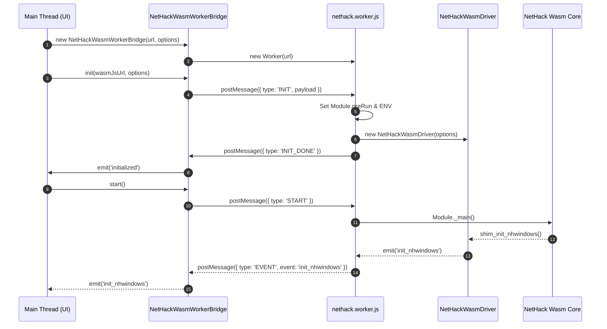
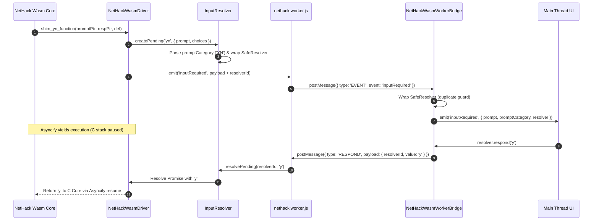

# NetHack-wasm-webUI 技術アーキテクチャ & 設計知識ベース (NotebookLM Knowledge Base)

本ドキュメントは、**NetHack-wasm-webUI** プロジェクトの技術スタック、WebAssembly/Web Worker 構成、主要モジュール設計、日本語パース・動的翻訳システム、および IndexedDB を用いたデータ永続化の設計仕様をまとめた構造化ナレッジベースです。
NotebookLM 等の LLM コンテキストとして読み込ませ、コードベースの解読・拡張・設計分析に利用することを目的としています。

---

## 1. プロジェクト概要 & 技術スタック (Project Overview & Tech Stack)

### 1.1 プロジェクトの目的
ローグライクゲームの金字塔である NetHack (C言語実装コア / NetHackJP) を WebAssembly (Wasm) にコンパイルし、ブラウザ上で動作するモダンな Web UI（DOM/Canvas/マルチフレームワーク対応）およびタッチ/ゲームパッド操作環境、動的日本語翻訳機能を提供すること。

### 1.2 コア技術スタック
- **Core Engine**: NetHack 3.7.0 (開発版) / NetHack 5.0.0 正式版 / NetHackJP C Core
- **Compilation / Toolchain**: Emscripten (C to Wasm), Asyncify (C言語のブロッキング呼び出しをJavaScriptのPromiseへ変換)
- **Execution Environment**: Web Workers (メインスレッドのUIレンダリング描画を保護するためWasmエンジンを別スレッドで実行)
- **Frontend / Rendering**:
  - HTML5 Canvas (標準 WebUI / 高性能スプライト描画)
  - DOM UI (モバイル向けレスポンシブ操作画面)
  - Plain JavaScript (ES6+), ESM モジュール
  - サンプル UI パッケージ: Vue 3, React, Svelte, SolidJS
- **Audio Engine**: Web Audio API (Event-driven 音声再生マッピング)
- **Persistence**: Emscripten IDBFS (IndexedDB による `/save/` ディレクトリの永続化)

---

## 2. WebAssembly / Web Worker アーキテクチャ & 通信モデル (Wasm/Worker Architecture)

Wasmコアは計算量の高いゲームループとCモジュール実行を担うため、Web Worker 内で完全非同期実行されます。メインスレッド（UI層）とは Message Passing を介して通信します。

```text
+-----------------------------------------------------------------------+
| Main Thread (UI / Renderer)                                          |
|  - Canvas / DOM / Framework UI (Vue, React, Svelte, SolidJS)          |
|  - NetHackWasmWorkerBridge (Facade API)                               |
|  - Input Handling (Keyboard, Touch, Gamepad)                          |
|  - SoundManager (Web Audio)                                           |
+-----------------------------------------------------------------------+
                                 ^ |
                 Worker Messages | | PostMessage (INIT, START, RESPOND)
                                 | v
+-----------------------------------------------------------------------+
| Web Worker Thread (nethack.worker.js)                                 |
|  - NetHackWasmDriver (Core Driver)                                    |
|  - InputResolver (SafeResolver, Prompt Category Parser)               |
|  - NetHackMemory (Wasm HEAP Reader / Status Decoder)                  |
|  - NetHackFSManager (Emscripten FS / IDBFS Sync)                      |
|  - Wasm Module (nethack.wasm / nethack_jp.wasm)                       |
+-----------------------------------------------------------------------+
```

### 2.1 Worker ↔ メインスレッド通信プロトコル

#### メインスレッド → Worker (Commands)
| Message Type | Payload / Parameters | 説明 |
| :--- | :--- | :--- |
| `INIT` | `{ wasmJsUrl, options }` | Wasm スクリプトの指定、環境変数 (`ENV`) や `Module` 設定の準備 |
| `START` | なし | Wasm モジュールのメインループを開始 |
| `RESPOND` | `{ resolverId, value }` | UI 側からのユーザー入力値（キーコード、テキスト、選択メニューなど）を Wasm に返送 |
| `GET_STATUS` | なし | 現在のドライバー状態を取得 |
| `FS_SYNC` | `{ populate }` | IndexedDB と Emscripten FS 間の同期リクエスト |

#### Worker → メインスレッド (Events & Callbacks)
| Message Type | Event Name / Payload | 説明 |
| :--- | :--- | :--- |
| `INIT_DONE` | なし | Wasm 初期化の完了通知 |
| `EVENT` | `inputRequired` | ユーザーからの入力待ち状態を通知。`promptCategory` や `safeResolver` 用 ID を同封 |
| `EVENT` | `display_nhwindow` | 画面描画更新要求 |
| `EVENT` | `status_update` | HP、階層 (`DLEVEL`)、所持金 (`Gold`) 等のステータス変更 |
| `EVENT` | `putstr` / `raw_print` | テキストログメッセージの出力通知 |
| `EVENT` | `stateChange` | ドライバー状態変更 (`IDLE`, `RUNNING`, `WAITING_INPUT`, `STOPPED`) |
| `EXIT` | `{ exitCode }` | Wasm プロセスの正常終了またはクラッシュの通知 |

---

## 3. 主要ソースファイル & コンポーネント設計 (Key Component Specifications)

### 3.1 `src/driver/NetHackWasmDriver.js`
- **役割**: Wasm C Shim 関数群（`shim_init_nhwindows`, `shim_putstr`, `shim_select_menu`, `shim_yn_function` 等）をディスパッチし、EventEmitter ベースで JavaScript イベントへ変換するドライバーコア。
- **特徴的な機能**:
  - `Asyncify` フック: C コアが入力待ち状態に入った際、JavaScript の `Promise` を返して C 側のスタックを待機状態にする。
  - C コアノイズログカット (`filterSysconfLogs: true`): 起動時の sysconf 関連ログの自動フィルター。
  - メッセージ重複除去 (`deduplicateMessages: true`): C コアが連続発行する同文面メッセージのカット。
  - 空メニュー自動応答 (`autoRespondEmptyMenu: true`): 選択項目がない通知用メニューへの自動応答。

### 3.2 `src/driver/NetHackWasmWorkerBridge.js`
- **役割**: UI 側メインスレッドで `NetHackWasmDriver` と同一のインターフェースを提供するファサードクラス。
- **特徴的な機能**:
  - `Worker` インスタンスの生成・管理。
  - `inputRequired` イベント受信時、Worker 側の `resolverId` をラップした `SafeResolver` を再構築し、UI から直感的に `.respond(value)` が呼べるようにカプセル化。
  - `unwrapPayload`: Vue 3 等の UI フレームワークが生成する `Proxy` や複合オブジェクトを透過的に Plain JS Object に分解して postMessage 転送。
  - `terminate()`: コンポーネント破棄時の Worker スレッド確実な停止処理。

### 3.3 `src/driver/nethack.worker.js`
- **役割**: Web Worker エントリポイント。
- **特徴的な機能**:
  - `importScripts` によるドライバー依存ファイル（`InputResolver`, `NetHackMemory`, `NetHackFSManager`, `NetHackWasmDriver`）の読み込み。
  - `self.Module.preRun` 内での `ENV.NETHACKOPTIONS` や `SAVEDIR=/save/` などの環境変数の初期化。
  - `locateFile` の相対パス・サブディレクトリ補正。

### 3.4 `src/driver/InputResolver.js`
- **役割**: Wasm C コアからの各種プロンプト・入力要求の自動分類と `SafeResolver` の生成。
- **特徴的な機能**:
  - **`SafeResolver`**: 一度 `.respond()` または `.cancel()` が呼ばれた Resolver に対する二重呼び出しを安全な no-op (無効処理) にする二重応答防止機構。
  - **`promptCategory` パース**: 入力待ちメッセージのテキストから、UI 側が扱いやすい型（`TEXT`, `YN`, `KEY`, `MENU`, `POSKEY`, `FILE`, `OTHER`）を自動判別して付与。
  - **ユーザープロンプト保護 (`isUserPromptContext`)**: 非ブロッキング描画処理が本物のユーザー入力待ち Resolver を上書き・Stale 化することを防ぐ二重チェックバリア。

### 3.5 `src/driver/NetHackMemory.js`
- **役割**: Emscripten `HEAPU8` / `HEAP32` メモリ領域を直接解析するユーティリティ。
- **特徴的な機能**:
  - C コアのポインタから文字列をデコード (`UTF8ToString`)。
  - `parseStatusUpdate`: `DLEVEL` (Field 20) 生データ (`"Dlvl:1"`, `"Tut:1"`) からダンジョンブランチ名 (`branch`) と数値階層 (`dlevelNum`) を構造化抽出。
  - `Gold` (Field 10) 生データの数値パースと `goldData` オブジェクト生成。

### 3.6 `src/driver/NetHackFSManager.js`
- **役割**: Emscripten の `FS` および `IDBFS` をカプセル化し、永続化ディレクトリ `/save` の管理とスコア/ログファイルの解析を担当。
- **特徴的な機能**:
  - ディレクトリ作成 (`/save`, `/tmp`) および IndexedDB のマウント。
  - `syncToPersistent(populate)` による双方向データ同期。
  - `NetHack.cnf` や `.nethackrc` 設定ファイルの初期動的生成。

### 3.7 `rogue/GameManager.js` & `UIManager.js`
- **役割**: アプリケーション全体のゲーム進行、画面レイアウト、ゲームオーバー処理の統合管理。
- **特徴的な機能**:
  - ゲームオーバー時のデータ検証（Wasm 直接メモリ参照 `_get_plname()` と `record` ファイルのタイムスタンプ整合性確認）。
  - 不一致時の安全なフォールバックゲームオーバー表示構築。

---

## 4. 日本語パース & メッセージ動的翻訳システム (Japanese Parsing & Translation)

本プロジェクトには、運用目的に応じた **2 種類の日本語動作モード** が搭載されています。

```text
[Message Output Path]
 C Core Message --> (Check Mode)
                      |
                      +---> [1] JS Dynamic Translation Engine (LANG_JP = true)
                      |       1. Check nhMessage.js / dictionary.csv
                      |       2. Regex Pattern Matching (nhPatterns)
                      |       3. Item/Entity Name Lookup (nhItems, nhEntities)
                      |       4. Un-translated log collection to localStorage
                      |
                      +---> [2] Native NetHackJP Direct Pass-through (LANG_JP = false)
                              1. UTF-8 Byte Stream directly from nethack_jp.wasm
                              2. Display directly via FontPrintControl
```

### 4.1 モード 1: 英語 Wasm + 動的パース翻訳エンジン (JS Translation Engine)
- **概要**: 英語版 `nethack.wasm` の出力を受け取り、JavaScript 側でリアルタイムに日本語へ分解・構造化・再構築して表示する方式。
- **関連ファイル**: `dictionary.csv`, `param/nhMessage.js`, `rogue/UI/trancelate.js`
- **主要仕組み**:
  1. **辞書引き**: [dictionary.csv](file:///c:/Users/e3-sh/Documents/GitHub/Nethack-wasm-webUI/dictionary.csv) からビルドされた `nhMessage.js` の完全一致マップによる直接翻訳。
  2. **品詞意識ルックアップ (`lookup_word`)**: 名詞 (`noun`)、形容詞 (`adj`)、動詞 (`verb`) の文脈に応じた翻訳補正。
  3. **動的文脈パース (`nhPatterns`)**: `"You kill the goblin!"` などの動的メッセージを正規表現パターンキャプチャし、`「ゴブリンを倒した！」` へ変換。
  4. **未翻訳収集**: 未翻訳メッセージを検知した際、`localStorage` (`nh.temp`) にログとして蓄積し、[tr_manager.html](file:///c:/Users/e3-sh/Documents/GitHub/Nethack-wasm-webUI/tr_manager.html) 経由で新単語として抽出可能。

### 4.2 モード 2: Native NetHackJP Wasm モード (Direct UTF-8 Pass-through)
- **概要**: 日本語版 C コアを直接ビルドした `nethack_jp.wasm` を使用し、C コアレベルでローカライズされた UTF-8 文字列をそのまま表示する方式。
- **関連ファイル**: [include_jp.js](file:///c:/Users/e3-sh/Documents/GitHub/Nethack-wasm-webUI/include_jp.js), `game_jp.html`
- **制御ロジック**:
  - [include_jp.js](file:///c:/Users/e3-sh/Documents/GitHub/Nethack-wasm-webUI/include_jp.js) 内の `window.g.define.LANG_JP = false` フラグにより、JS 翻訳エンジンをバイパス（パススルー）し、Wasm が吐き出す Native UTF-8 文字列をそのまま描画エンジンに流し込む。

---

## 5. データ永続化 & セーブシステム (Data Persistence & IndexedDB Design)

Emscripten の仮想ファイルシステム (MEMFS) とブラウザの IndexedDB を組み合わせ、セーブデータやスコアログの同期・永続化を行っています。

```text
Emscripten MEMFS (Virtual RAM)                 Browser IndexedDB (IDBFS)
+-------------------------------+              +-------------------------------+
| /save/                        |  syncfs()    | Database: /save               |
|  ├── savefile (plname.gz)     | <----------> |  ├── savefile (plname.gz)     |
|  ├── record                   | (Bi-directional| ├── record                   |
|  └── logfile                  |  Timestamp)  |  └── logfile                  |
+-------------------------------+              +-------------------------------+
```

### 5.1 ディレクトリ構成と IDBFS マウント
- `/save`: IDBFS (IndexedDB) をマウント。ゲームのセーブファイル (`/save/*.gz`) や `record`, `logfile` を永続保存。
- `/tmp`: MEMFS (一時メモリ)。プレイ中の一時作業ファイル用。

### 5.2 データ同期メカニズムと安全対策
1. **双方向タイムスタンプ比較同期**:
   - `syncToPersistent(populate)` 実行時、メモリ上の仮想ファイルシステムと IndexedDB 上の同名ファイルの最終更新日時（タイムスタンプ）を比較。
   - 古いデータによる最新セーブデータの破棄・上書き事故を防止。

2. **ゲームオーバー・レコード整合性確認**:
   - ゲームオーバー時、Wasm エクスポート関数 `Module._get_plname()` からメモリ上の最新プレイヤー名を直接読み出し。
   - `record` ファイルから抽出したデータが現在のプレイヤーデータと合致するか「名前」「最終HP」「到達階層 (Depth)」「ロール」で多重判定。
   - レコード不整合（ハイスコア枠外での死亡等）を検知した場合、`GameManager.js` のフォールバック表示機構が起動し、メモリ上の直近 `statusFields` から正しい死亡画面を表示。

---

## 6. イベントフロー詳細図解 (Event Flow Diagrams)

### 6.1 初期化 & Worker 起動フロー



### 6.2 非同期入力プロンプト処理フロー (Asyncify & SafeResolver)



---

## 7. 開発者向けまとめ (Developer Summary)

- **コア層と UI 層の分離**: `NetHackWasmDriver` と `NetHackWasmWorkerBridge` により、Wasm 制御とフレームワーク UI (Vue/React/Vanilla) が完全に疎結合化されています。
- **入力の安全性**: `SafeResolver` と `isUserPromptContext` により、非同期入力時の連打や非ブロッキング描画による状態破損・フリーズが発生しない堅牢な設計となっています。
- **多言語対応の柔軟性**: 辞書ベースの動的翻訳（英語版 Wasm）と、NetHackJP Native Wasm の両方に対応可能なデュアルエンジン構造を持っています。
- **データ保護**: Emscripten IDBFS とタイムスタンプ比較ロジックにより、ブラウザ上のセーブデータおよびスコアログが安全に保持されます。
