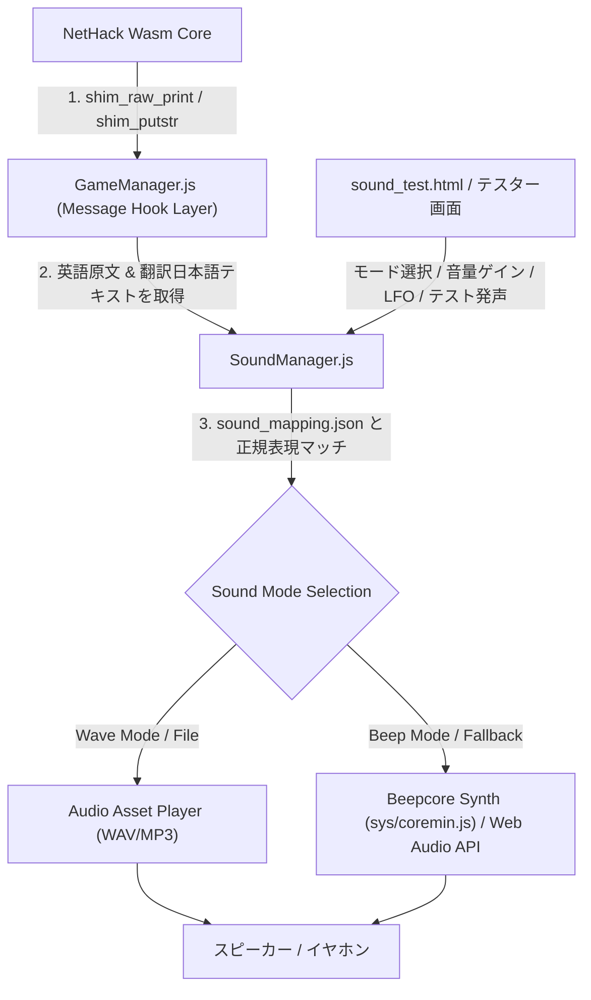

# NetHack WASM WebUI 音声再生システム 仕様 & 技術ドキュメント

> [!NOTE]
> 本ドキュメントは、NetHack WASM WebUI における音声再生（効果音）システムのアーキテクチャ、データ構造、音源モジュール、フック機構、および運用仕様をまとめた技術仕様書です。

---

## 1. 概要と基本方針

### 1.1. 背景
NetHack 3.7 / 5.0 には C言語構造体ベースの統合サウンド機構 (`soundprocs`) が導入されていますが、WASM ビルド（`winshim.c`）経由で WebUI へ音発生イベントを直接通知するコールバックは用意されていません。

### 1.2. 採用アーキテクチャ：本家 `usersounds` 方式（メッセージフック）
NetHack の伝統的なサウンド機能である **`usersounds`** 仕様（画面に出力されるメッセージテキストと効果音・音量をパターンマッチで結びつける方式）を採用しています。

* **本アプローチのメリット**:
  1. NetHack 本体（C言語コードおよび WASM ビルド）に手を加える必要が一切ない。
  2. `GameManager.js` の shim イベントフック層でキャプチャするため、WebUI（JavaScript/JSON）側のみで完全独立してメンテナンスが可能。
  3. JSON 設定ファイル（`sound_mapping.json`）を編集・拡充するだけで、効果音ルールや音階を簡単に調整可能。

---

## 2. システムアーキテクチャ

### 2.1. 全体フロー



### 2.2. 主要コンポーネントの役割

1. **Message Hook Layer (`GameManager.js`)**
   * NetHack から送られてくる行動メッセージ（`shim_raw_print`, `shim_raw_print_bold`, `shim_putstr`）をリアルタイムに検出します。
   * C言語側からの **「英語原文メッセージ」** と `trancelate.js` による **「翻訳後日本語メッセージ」** の両方を `SoundManager.processMessage()` に流し込んで判定します。
   * ※ 長文ダイアログ（ヘルプ画面やニュース画面）は除外フィルターによって処理されます。

2. **SoundManager (`rogue/SoundManager.js`)**
   * マッピングルール（`sound_mapping.json`）の保持とインライン初期ルールの提供。
   * メッセージに対する正規表現 (`RegExp`) パターンマッチング判定。
   * 音階設定、クールダウン制御（重複再生防止）、直線音量スケールおよび独立ゲイン補正の適用。
   * クライアント動作環境（Autoplay 規制）に応じた `AudioContext.resume()` の制御。

3. **Hybrid Audio Engine**
   * **Wave Engine**: `assets/sounds/` 内の WAV/MP3 アセットを低遅延再生。ロード失敗時には自動で Beep 合成音へフォールバックします。
   * **Beep Engine**: `sys/coremin.js` 内の `Beepcore` クラスを利用した 8bit レトロシンセサイザー音源。Web Audio API オシレーターおよび LFO (ビブラート) 機能により、アセット不要で表現力豊かな合成音を生成します。

---

## 3. 音源モードと音量・ゲイン仕様

### 3.1. 音源モード

`SoundManager` は以下の4つの音源モードに対応しています：

| モード値 | 名称 | 説明 |
| :--- | :--- | :--- |
| `auto` | **標準 (Auto / Hybrid)** | ルールに WAV ファイルがある場合は WAV、無い場合は Beep 合成音を再生（自動フォールバック対応）。 |
| `wave` | **オーディオファイル** | WAV/MP3 オーディオファイルのみを再生（ロード失敗時のみ Beep にフォールバック）。 |
| `beep` | **Beep合成音** | すべての効果音を `Beepcore` / Web Audio API の 8bit レトロ合成音で発声。 |
| `mute` | **OFF (消音)** | 効果音の発生をすべてスキップ。（**初回起動時のデフォルト設定**） |

### 3.2. 独立音量ゲイン制御 (バランス補正)

オーディオアセット（WAV/MP3）と合成音（Beep/矩形波等）の物理的な音量特性の差を整えるため、マスター音量とは独立したバランス補正ゲインプロパティを搭載しています：

* **`waveGain`** (デフォルト `1.0` / 100%): オーディオファイル再生用の音量補正倍率。
* **`beepGain`** (デフォルト `0.3` / 30%): Beep 合成音再生用の音量補正倍率。（アタックの強い矩形波やノコギリ波を 30% に減衰させることで、WAV との聴感上の音量バランスを自然に揃えます）

$$\text{WAV最終音量} = \left(\frac{\text{rule.volume}}{100}\right) \times \left(\frac{\text{マスター音量}}{100}\right) \times \text{waveGain}$$
$$\text{Beep最終音量} = \left(\frac{\text{rule.volume}}{100}\right) \times \left(\frac{\text{マスター音量}}{100}\right) \times \text{beepGain}$$

---

## 4. データ構造定義 (`sound_mapping.json`)

```json
{
  "soundDir": "assets/sounds/",
  "defaultVolume": 80,
  "waveGain": 1.0,
  "beepGain": 0.3,
  "rules": [
    {
      "id": "se_drink_good",
      "pattern": "feel better|feel much better|feel full of energy|気分が良|体調が良|元気がみなぎる",
      "sound": "drink_good.mp3",
      "beep": {
        "notes": ["C4", "E4", "G4", "C5"],
        "wave": "sine",
        "duration": 70,
        "lfo": { "freq": 6, "wave": "sine", "depth": 15 }
      },
      "volume": 85
    },
    {
      "id": "se_drink_bad",
      "pattern": "feel sick|poisoned|blind|confused|気分が悪|体調が悪|毒|病気|混乱|麻痺",
      "sound": "drink_bad.mp3",
      "beep": {
        "notes": ["G3", "C#3", "C3"],
        "wave": "sawtooth",
        "duration": 120,
        "lfo": { "freq": 12, "wave": "sawtooth", "depth": 30 }
      },
      "volume": 90
    },
    {
      "id": "se_door",
      "pattern": "door|ドア|扉|locked|鍵|開け|閉め|壊れた|resists|crashes",
      "sound": "door_lock.mp3",
      "beep": { "notes": ["G3", "C3"], "wave": "square", "duration": 80 },
      "volume": 90
    }
  ]
}
```

### 4.1. Beep LFO (ビブラート) パラメータ仕様と記載例

`beep` オブジェクト内において **`"lfo"`** オブジェクトの有無によって LFO (ビブラート/モジュレーション) 機能の ON/OFF を切り替えることができます：

* **`"lfo"` パラメータ指定時**: LFO が **ON** になり指定した速度と深さでビブラートがかかります。
* **`"lfo"` パラメータ省略時**: LFO が **OFF** になり、ストレートなピュア音になります。

#### 比較：JSON 記載例

##### ① LFO ありの記載例 (ビブラート・揺らぎ効果音)
```json
"beep": {
  "notes": ["C4", "E4", "G4", "C5"],
  "wave": "sine",
  "duration": 70,
  "lfo": {
    "freq": 6,
    "wave": "sine",
    "depth": 15
  }
}
```

##### ② LFO なしの記載例 (標準ピュア音)
```json
"beep": {
  "notes": ["G3", "C3"],
  "wave": "square",
  "duration": 80
}
```

* **LFO パラメータ詳細**:
  * `freq`: LFO の速度 (Hz)。例: `6` (自然なビブラート), `20` (高速トレモロ)
  * `depth`: LFO の変調の深さ (ピッチの揺れ幅)。例: `15` 〜 `30`
  * `wave`: LFO 自身の変調波形 (`"sine"` [滑らか・推奨], `"square"`, `"sawtooth"`, `"triangle"`)

---

## 5. テスト＆デバッグ環境

開発・調整用ツールとして **[sound_test.html](file:///c:/Users/e3-sh/Documents/GitHub/Nethack-wasm-webUI/sound_test.html) (Sound Tester)** が用意されています。

* **リアルタイムメッセージ判定テスト**: 任意のメッセージを入力して、どのルールにマッチするかを即座にシミュレーション検証可能。
* **独立音量バランス調整スライダー**: `WAV Balance Gain` (0%〜200%) および `Beep Balance Gain` (0%〜200%) を耳で聴きながらリアルタイムに微調整・保存可能。
* **登録済みルール一覧＆試聴**: 登録されている全ルールの `Auto`, `Beep`, `Wave` 音を個別に試聴可能（マスター音量およびバランスゲインが適用されます）。
* **Beepcore 生音シンセサイザー & LFO テスト**: 音階ノート（`C4`, `E4`, `G4` 等）や波形に加え、LFO (速度Hz, 深さ, 波形) を有効化して動的にビブラート合成音を試聴・実験可能。
* **AudioContext ステータスモニタリング**: ブラウザの自動再生ロック状態（`running` / `suspended`）を可視化し、ワンクリックでアンロック可能。

---

## 6. 関連ドキュメント

* [soundprocs_shim_research.md](file:///c:/Users/e3-sh/Documents/GitHub/Nethack-wasm-webUI/docs/soundprocs_shim_research.md) - NetHack 5.0 soundprocs アーキテクチャと WASM shim 拡張に関する技術考察・研究レポート
* [README.md](file:///c:/Users/e3-sh/Documents/GitHub/Nethack-wasm-webUI/README.md) - プロジェクト全体の概要
* [shim_reference.ja.md](file:///c:/Users/e3-sh/Documents/GitHub/Nethack-wasm-webUI/docs/shim_reference.ja.md) - NetHack WASM shim インターフェースリファレンス
